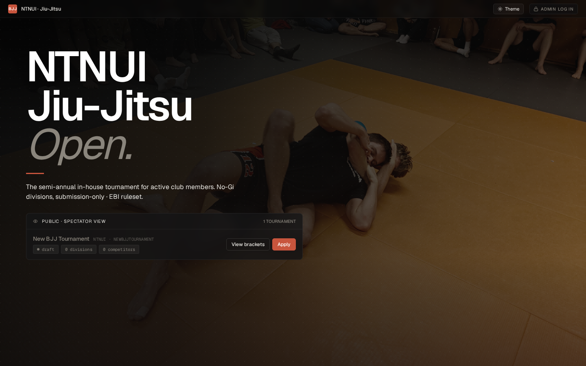
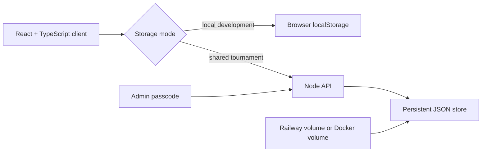

# BJJ Tournament Desk

A full-stack tournament operations tool for Brazilian jiu-jitsu events: registrations, divisions, brackets, match scoring, scheduling, and shared persistent storage.



> The entry screen separates public spectator access, competitor applications, and passcode-gated admin operations. The landing photo (club's own) establishes the event context.

## Recruiter quick read

| Signal | Evidence in this repository |
|---|---|
| **Startup product work** | One codebase covers participant intake, admin workflows, competition rules, and live event operations. |
| **Domain modelling** | Rulesets, brackets, CSV import/export, weigh-ins, mat scheduling, and match state are explicit application concepts. |
| **Full-stack delivery** | React/Vite frontend, Node API, local-first fallback, persistent server storage, health checks, and container deployment. |
| **Quality** | Focused unit tests cover brackets, CSV handling, and rulesets; the production bundle is built in CI. |

## Product flow

1. Create or join a tournament.
2. Import or register competitors and organise divisions.
3. Generate brackets and assign matches to mats.
4. Run scoring and match operations from the admin desk.
5. Publish tournament state to guest and spectator views.

## Architecture



Local-first storage keeps frontend development fast. The same built client can be served by the Node backend when multiple devices need shared tournament state.

## Local development

```bash
npm install
npm run dev
```

The Vite development server uses browser `localStorage` by default.

To exercise the shared backend path:

```bash
npm run build
ADMIN_PASSCODE=local-admin npm run dev:server
```

The backend serves `dist/` and stores tournament state in `./data/tournament-store.json` unless `DATA_DIR` is set.

## Verify

```bash
npm test -- --maxWorkers=1 --no-file-parallelism
npm run build
```

## Deploy

Railway reads `railway.json`, builds with Railpack, runs `npm run build`, and starts the backend with `npm start`. Set `ADMIN_PASSCODE` and attach a persistent volume; the backend automatically uses `RAILWAY_VOLUME_MOUNT_PATH` when available.

For a VPS:

```bash
cp .env.example .env
# set a real ADMIN_PASSCODE
docker compose up -d --build
curl http://127.0.0.1:3000/api/health
```

Tournament data lives in the `tournament_data` Docker volume at `/app/data`.

## Operational limitations

- The shared store is intentionally small and simple; it is not a multi-tenant database.
- The admin passcode protects organiser actions but is not a full identity system.
- Persistent storage must be attached in hosted environments or tournament state can disappear during redeploys.
